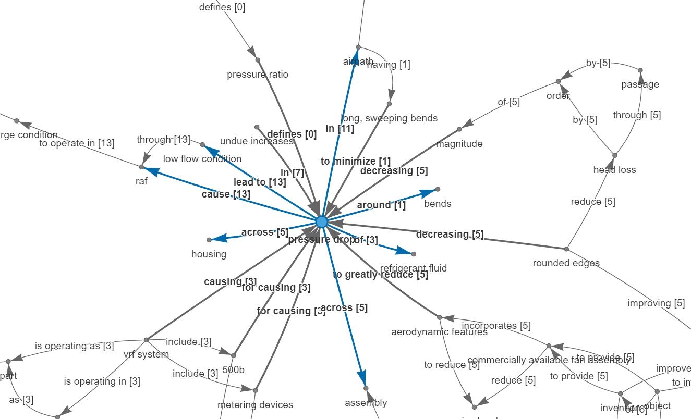

# Using engineering design knowledge from patents for retrieval-augmented generation in the design process
In this document, I describe how Large-Language Models (LLMs) could be instructed to generate factual responses to support various applications in the engineering design process. I put forward three scenarious as follows.

 - Scenario 1: Directly asking LLM about a component or an issue.
 - Scenario 2: Provide a text document as a reference and asking LLM about a component or an issue.
 - Scenario 3: Providing design knowledge in the form of facts (entity :: relationship :: entity) as a reference.

The tenet of my research is that design knowledge, when explicated as facts, could be more beneficial for interacting with LLMs and generating more meaningful responses for engineering design applications. The underlying method for explicating facts is described in the following paper.

*Siddharth, L., Luo, J., 2024. Retrieval-Augmented Generation using Engineering Design Knowledge. (cs.CL). arXiv (cs.CL) https://arxiv.org/abs/2307.06985.*

## Using GPT for knowledge retrieval

First, let us understand how LLMs are used for generating text according to our needs. The following function could be used for interacting with GPT through API.
```
from openai import OpenAI
#For API key, visit 'https://platform.openai.com/api-keys'
client = OpenAI(api_key="Your API Key")

#For other latest models, visit 'https://platform.openai.com/docs/models/overview'
def gpt(temperoryChat, textGenerationModel="gpt-3.5-turbo-1106"):
    completion = client.chat.completions.create(
      model=textGenerationModel,
      messages=temperoryChat)
    
    return str(completion.choices[0].message.content)
```

The general syntax is to provide system instructions and user input/query in the following format to generate a response.
```
chat = [
    {"role": "system", "content": "Necessary instructions, rules, and conditions to be given here."},
    {"role": "user", "content": "The main task or query to be given here"}
]
output = gpt(chat)
print(output)
```

## Using GPT to understand belt drives in fan systems

As the code required to interact with GPT is clear, let us understand how GPT could be used and instructed with specific context.
Here, I am focussing on the domain of fan systems and try to understand a key component and a notable issue through GPT.

Belt drive is a key component in fan systems. Let us ask GPT to describe it as follows.

```
#The instructions could be altered in any way preferable.
chat = [
    {"role": "system", "content": "The output should be a single paragraph within 100 words."},
    {"role": "user", "content": "Provide a technical description of belt drives in fan systems."}
]
print(gpt(chat), "\n\n")
```
The above code results in the following output.
>In fan systems, belt drives are used to transfer power from the motor to the fan shaft. A belt drive typically consists of a belt, pulleys, and a tensioning system. The motor's rotational energy is transferred to the fan shaft through the friction between the belt and the pulleys. The pulleys are usually connected by the belt and are of different sizes to create a speed differential between the motor and the fan. Tensioning systems are used to adjust the tension of the belt, ensuring proper power transmission. Belt drives are chosen for fan systems due to their efficiency, flexibility in speed adjustments, and cost-effectiveness. 

The above output appears quite common-sensical and devoid of references, lacking adequate for usage in engineering design applications. It is necessary to provide GPT with some domain context as follows.

## Applying RAG to GPT for understanding belt drives in fan systems

In the [work](https://arxiv.org/abs/2307.06985) referred earlier, I retrieved 4,870 patents related to fan systems and applied the proposed method in the paper to extract facts from the sentences in these.
The extraction lead to populating over 2.9 million facts that consitute a knowledge base of fan systems.

In retrieval augmented generation, context for GPT could either be portion of these patents or the facts extracted from these. Since none of the patent abstracts include the term "belt drive" and that entire patent documents cannot be given as context to GPT due to the [token limits](https://platform.openai.com/docs/models/gpt-3-5-turbo), I am giving selected facts to GPT as context.

The following is a portion of the knowledge graph constructed using 83 facts that represent belt drive. The interactive graph could be visualised in the [external link](https://fansystems.vercel.app/beltdrive).


As follows, I providing the facts mentioned above to GPT as context.

```
chat = [
    {"role": "system", "content": "The context includes facts in the form - 'entity :: relationship :: entity'."},
    {"role": "system", "content": "The output should be a single paragraph within 100 words."},
    {"role": "user", "content": f"Provide a technical description of belt drives in fan systems based on the following context.\n\n{facts}"}
]
print(gpt(chat), "\n\n")
```
The above code results in the following output.
>Belt drives in fan systems use a belt that is frictionally coupled to the drive shaft which rotates the fan. The belt also drives the belt-driven wheels connected by a transmission belt. The means for rotating the ring fan comprises an electric motor with a rotor, including the belt drive. It's employed in the front engine accessory drive of automotive vehicles, where the cooling fan includes a drive pulley and a belt extending around it, ensuring peak fan operating efficiency and facilitating the transfer of torque to the radial fan. The belt-driven fan characterized by low maintenance, enhanced reliability, reduced noise, and vibration, providing an efficient and reliable fan system.

We can observe from the above output that GPT is able to acquire and synthesise knowledge across patents into a coherent description of belt drive. Such synthesised knowledge takes into account structures, behaviours, and functions of entities associated with belt drive. If users intend to gather more details about the associated entities, it is preferable to navigate the [knowledge graph](https://fansystems.vercel.app/beltdrive) and possibly explore knowledge graph of other entities as well.

## Using GPT to understand pressure drop issue in fan systems

The design process often requires addressing key issues that occur in components. It often also occurs that such issues have been previously addressed in products of similar domain and it would be useful to acquire such knowledge. In this case, let us consider a common issue "pressure drop" that is recurrent in fan systems.

Since this is a common issue that is acknowledged in various public documents, let us inquire GPT regarding this issue as follows.

```
chat = [
    {"role": "system", "content": "The output should be a single paragraph within 100 words."},
    {"role": "user", "content": f"Provide a technical description of the causes and solutions of pressure drop issue in fan systems."}
]
print(gpt(chat), "\n\n")
```

The above code resuls in the following output.
>Pressure drop in fan systems can be caused by factors such as obstructions in the ductwork, excessive bends, or a narrow duct diameter. These issues create resistance to the airflow, resulting in decreased pressure. The solutions involve optimizing the duct layout to minimize bends and obstructions, using larger ducts to reduce airflow resistance, and ensuring proper sealing and insulation to prevent air leakage. Additionally, selecting the right fan with an appropriate size and efficiency can help mitigate pressure drop issues in fan systems. Regular maintenance and cleaning of ductwork are also important to ensure optimal airflow and minimal pressure drop.

The above response includes various speculative causes and solutions without adequate details necessary for implementation. The suggestions like regular maintenance and cleaning are quite common sensical and less useful for a design process. To enable GPT to provide a contextualised response, I retrieved the following patents whose abstract includes the term "pressure drop".

 - Compact low noise efficient blower for CPAP devices. [https://patents.google.com/patent/US9677563B2/](https://patents.google.com/patent/US9677563B2/)
 - Fan with integrated nonreturn flaps. [https://patents.google.com/patent/US8057161B2/](https://patents.google.com/patent/US8057161B2/)

Since the whole patent cannot be given as context to GPT, let us provide the abstracts as follows.

```
chat = [
    {"role": "system", "content": "The context includes patent descriptions of a fan system."},
    {"role": "system", "content": "The output should be a single paragraph within 100 words."},
    {"role": "user", "content": f"Provide a technical description of the causes and solutions of pressure drop issue in fan systems based on the following context.\n\n{context}"}
]
print(gpt(chat), "\n\n")
```

The above code results in the following output.
>Pressure drop in fan systems is caused by narrow flow paths and obstructions that hinder the smooth flow of gas. In the described patents, the pressure drop issue is addressed by ensuring that the gas flow path is of sufficient width to allow for smooth gas flow without introducing excessive pressure drop. This is achieved by using stationary vane structures, shielding functions, and non-return flaps to guide the gas flow along a curved path, isolate leading edges from impeller blade pressure pulses, and prevent reverse flow of air when fan activity is interrupted. Additionally, the use of elastomers at critical points in the structure reduces noise and clatter, further optimizing the fan system's efficiency.

The above response is an attempt to rephrase the abstracts thus provided, while including other information from the abstract like noise and clatter that is not relevant to the issue that is being queried. In one of the patents, pressure drop is only mentioned to have been minimised by the width of flow path. Since GPT is yet to identify such specific portions of text and discard others, it is necessary that the context needs to be more specific as in the facts tied to the issue at hand. From the knowledge base, I retrieved 250 facts relevant to pressure drop as shown below.



The entire knowledge graph could be viewed interactively in an external [link](https://fansystems.vercel.app/pressuredrop). Let us provide the facts on this knowledge graph to GPT as follows.

```
chat = [
    {"role": "system", "content": "The context includes facts in the form - 'entity :: relationship :: entity'."},
    {"role": "system", "content": "The output should be a single paragraph within 100 words."},
    {"role": "user", "content": f"Provide a technical description of the causes and solutions of pressure drop issue in fan systems based on the following context.\n\n{facts}"}
]
print(gpt(chat), "\n\n")
```

The above code results in the following output.
>The pressure drop issue in fan systems can be attributed to various factors including the flow path through apertures, bends, and filters, as well as the design of impellers and vanes. The causes of pressure drop can stem from disruptions in airflow due to disarray, accumulations of dust on particulate filters, and inadequate flow area leading to the formation of vortices. Solutions to address these issues involve incorporating aerodynamic features such as rounded edges and streamlined airpaths, utilizing fans with larger surface areas and applying spline structures to reduce pressure drop. Additionally, employing piezometer rings for sensing pressure drops and utilizing proper filter materials can help mitigate the problem. 

The above response shows how specific solutions like "rounded edges" and "spline structures" are being suggested by GPT. These solutions could be further explored in depth by navigating the [knowledge graph](https://fansystems.vercel.app/pressuredrop) and the patents referred in the edges. Providing specific facts as context prevents GPT from drawing noisy infomation when text is provided direclty. Also, GPT can only handle to a certain length of context that is not possible when several documents have to search for specific issues like pressure drop. Therefore, coupling knowledge retrieval algorithms such as the one proposed in our [paper](https://arxiv.org/abs/2307.06985) along with domain documents could faciliate controlled and meaningful use of GPT and other LLMs in future.

For any queries, please write to [siddharthl.iitrpr.sutd@gmail.com](mailto:siddharthl.iitrpr.sutd@gmail.com)


